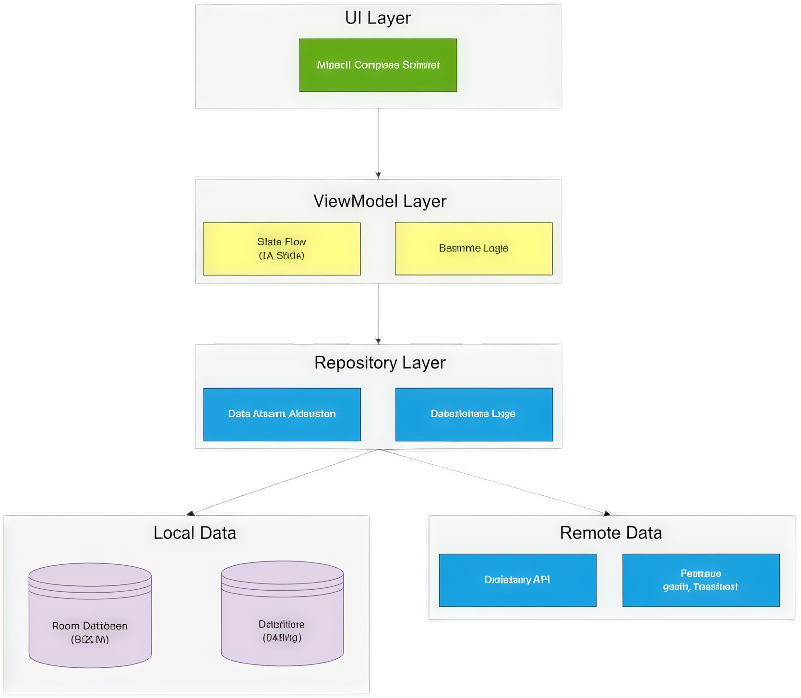

# EzWordMaster


[](https://kotlinlang.org)
[](https://www.oracle.com/java/technologies/javase/jdk17-archive-downloads.html)
[](https://gradle.org)
[-orange>)](https://developer.android.com/topic/architecture)
[](https://developer.android.com/jetpack/compose)
[](https://firebase.google.com)

**EzWordMaster** là một ứng dụng học từ vựng di động toàn diện, được xây dựng với kiến trúc "offline-first" kết hợp đồng bộ hóa đám mây. Ứng dụng cho phép người dùng quản lý từ vựng theo chủ đề, ôn tập qua nhiều phương pháp, và theo dõi tiến độ.

Nhờ tích hợp Firebase, ứng dụng hỗ trợ **xác thực người dùng**, **đồng bộ hóa dữ liệu** (chủ đề, từ vựng) lên đám mây, và nhận **thông báo đẩy (push notifications)**.

## 🔍 Thông tin thêm

- [Báo cáo](#)
- [Design](https://www.figma.com/design/A6rw39IXQP0aWaGc4lGeKg/EzWordMaster?node-id=384-453&t=wp5tAfkBSJnFsPdv-1)

## 🏛️ Sơ đồ Kiến trúc (Architecture)

Dự án tuân thủ theo mô hình **Clean Architecture** (UI, Domain, Data) kết hợp với **MVVM** và **Repository Pattern**. Kiến trúc này đảm bảo sự tách biệt rõ ràng giữa các lớp, giúp code dễ bảo trì, mở rộng và kiểm thử.

- **UI Layer (Lớp Giao diện)**: Sử dụng Jetpack Compose và ViewModel. Chịu trách nhiệm hiển thị dữ liệu và xử lý tương tác người dùng.
- **Domain Layer (Lớp Nghiệp vụ)**: Chứa các logic nghiệp vụ cốt lõi và các `Repository Interfaces` (ví dụ: `ITopicRepository`, `IAuthRepository`). Lớp này không phụ thuộc vào `data` hay `ui`.
- **Data Layer (Lớp Dữ liệu)**: Chịu trách nhiệm triển khai (implementation) các repository. Nó quyết định nơi lấy dữ liệu:
  - **Local**: Room Database, DataStore Preferences.
  - **Cloud**: Firebase Firestore (đồng bộ từ vựng).
  - **Remote**: Retrofit API (dịch thuật).
  - **FCM**: Firebase Cloud Messaging (nhận thông báo).

## 🗂️ Cấu trúc cây thư mục

```
├── 🗃️ data
│   ├── 📁 cloud
│   │   ├── ☕ CloudStudyResultRepository.kt
│   │   └── ☕ CloudTopicRepository.kt
│   ├── 📁 di
│   │   └── ☕ NetworkModule.kt
│   ├── 📁 fcm
│   │   └── ☕ MyFirebaseMessagingService.kt
│   ├── 🗂️ local
│   │   ├── 📁 converters
│   │   │   ├── ☕ DateConverter.kt
│   │   │   └── ☕ StringListConverter.kt
│   │   ├── 📁 dao
│   │   │   ├── ☕ NotificationDao.kt
│   │   │   ├── ☕ StudyResultDao.kt
│   │   │   ├── ☕ TopicDao.kt
│   │   │   ├── ☕ TranslationHistoryDao.kt
│   │   │   └── ☕ WordDao.kt
│   │   ├── 📁 database
│   │   │   └── ☕ EzWordMasterDatabase.kt
│   │   ├── 📁 entity
│   │   │   ├── ☕ NotificationEntity.kt
│   │   │   ├── ☕ StudyResultEntity.kt
│   │   │   ├── ☕ TopicEntity.kt
│   │   │   ├── ☕ TranslationHistoryEntity.kt
│   │   │   └── ☕ WordEntity.kt
│   │   ├── 📁 mapper
│   │   │   ├── ☕ StudyResultMapper.kt
│   │   │   └── ☕ TopicMapper.kt
│   │   └── ☕ SettingsDataStore.kt
│   ├── 📁 remote
│   │   └── ☕ DictionaryApi.kt
│   ├── 📁 repository
│   │   ├── ☕ AuthRepositoryImpl.kt
│   │   ├── ☕ NotificationRepositoryImpl.kt
│   │   ├── ☕ SettingsRepositoryImpl.kt
│   │   ├── ☕ StudyResultRepositoryImpl.kt
│   │   ├── ☕ TopicRepositoryImpl.kt
│   │   ├── ☕ TranslationRepositoryImpl.kt
│   │   └── ☕ UserRepositoryImpl.kt
│   └── 📁 worker
│       ├── ☕ NotificationScheduler.kt
│       └── ☕ NotificationWorker.kt
├── 🗃️ domain
│   └── 📁 repository
│       ├── ☕ IAuthRepository.kt
│       ├── ☕ ICloudStudyResultRepository.kt
│       ├── ☕ ICloudTopicRepository.kt
│       ├── ☕ INotificationRepository.kt
│       ├── ☕ ISettingsRepository.kt
│       ├── ☕ IStudyResultRepository.kt
│       ├── ☕ ITopicRepository.kt
│       ├── ☕ ITranslationRepository.kt
│       └── ☕ IUserRepository.kt
├── 📁 model
│   ├── ☕ ApiDtoModels.kt
│   ├── ☕ Backup.kt
│   ├── ☕ PracticeUiStateModels.kt
│   ├── ☕ QuizModels.kt
│   ├── ☕ StudyModels.kt
│   ├── ☕ Topic.kt
│   ├── ☕ Translate.kt
│   ├── ☕ TranslationApiModels.kt
│   ├── ☕ UiSpecificModels.kt
│   └── ☕ UserData.kt
├── 🗃️ ui
│   ├── 📁 common
│   │   ├── ☕ AppBackground.kt
│   │   ├── ☕ AuthLayout.kt
│   │   ├── ☕ CommonTopAppBar.kt
│   │   ├── ☕ GradientBackground.kt
│   │   ├── ☕ HeaderBar.kt
│   │   ├── ☕ LoginRedirect.kt
│   │   ├── ☕ QuizComponents.kt
│   │   ├── ☕ SortDropdownMenu.kt
│   │   ├── ☕ TranslationHelper.kt
│   │   └── ☕ TranslationPopup.kt
│   ├── 📁 navigation
│   │   └── ☕ AppNavHost.kt
│   ├── 🗂️ screens
│   │   ├── 📁 about
│   │   │   └── ☕ AboutScreen.kt
│   │   ├── 📁 auth
│   │   │   ├── ☕ AuthViewModel.kt
│   │   │   ├── ☕ ForgotPasswordSreen.kt
│   │   │   ├── ☕ LoginSreen.kt
│   │   │   └── ☕ RegisterScreen.kt
│   │   ├── 📁 backup
│   │   │   ├── ☕ BackupScreen.kt
│   │   │   └── ☕ BackupViewModel.kt
│   │   ├── 📁 help
│   │   │   ├── ☕ HelpScreen.kt
│   │   │   └── ☕ HelpViewModel.kt
│   │   ├── 📁 history
│   │   │   ├── ☕ HistoryViewModel.kt
│   │   │   └── ☕ StudyHistoryScreen.kt
│   │   ├── 📁 notification
│   │   │   ├── ☕ NotificationScreen.kt
│   │   │   └── ☕ NotificationViewModel.kt
│   │   ├── 🗂️ regime
│   │   │   ├── 📁 entertainment
│   │   │   │   ├── ☕ FlipCardScreen.kt
│   │   │   │   ├── ☕ FlipCardViewModel.kt
│   │   │   │   └── ☕ FlipResultScreen.kt
│   │   │   ├── 🗂️ practice
│   │   │   │   ├── 📁 flash
│   │   │   │   │   ├── ☕ FlashcardScreen.kt
│   │   │   │   │   └── ☕ FlashcardViewModel.kt
│   │   │   │   └── 📁 quiz
│   │   │   │       ├── ☕ EssayQuizScreen.kt
│   │   │   │       ├── ☕ MultiChoiceQuizScreen.kt
│   │   │   │       ├── ☕ QuizViewModel.kt
│   │   │   │       └── ☕ TrueFalseQuizScreen.kt
│   │   │   ├── ☕ PracticeScreen.kt
│   │   │   ├── ☕ PracticeViewModel.kt
│   │   │   ├── ☕ ResultScreen.kt
│   │   │   ├── ☕ ResultViewModel.kt
│   │   │   ├── ☕ WordPracticeScreen.kt
│   │   │   └── ☕ WordSelectionScreen.kt
│   │   ├── 📁 settings
│   │   │   ├── ☕ SettingsScreen.kt
│   │   │   └── ☕ SettingsViewModel.kt
│   │   ├── 📁 topic_managment
│   │   │   ├── ☕ EditTopicScreen.kt
│   │   │   ├── ☕ TopicManagementScreen.kt
│   │   │   └── ☕ TopicViewModel.kt
│   │   ├── 📁 translationScreen
│   │   │   ├── ☕ TranslationScreen.kt
│   │   │   └── ☕ TranslationViewModel.kt
│   │   ├── ☕ HomeScreen.kt
│   │   ├── ☕ IntroScreen.kt
│   │   └── ☕ MainHomeScreen.kt
│   ├── 🗂️ theme
│   │   ├── ☕ Theme.kt
│   │   └── ☕ Type.kt
│   ├── ☕ AppContainer.kt
│   └── ☕ ViewModelFactory.kt
├── 🗂️ utils
│   └── ☕ NotificationSettings.kt
└── ☕ MainActivity.kt
```

## ✨ Tính năng chính

Dựa trên cấu trúc thư mục, các tính năng của ứng dụng bao gồm:

- **Xác thực Người dùng (`/auth`)**

  - Đăng ký tài khoản mới.
  - Đăng nhập (Email/Password).
  - Quên mật khẩu.

- **Quản lý Từ vựng (`/topic_managment`)**

  - Quản lý Chủ đề (Thư mục): Thêm, sửa, xóa.
  - Quản lý Từ vựng: Thêm, sửa, xóa từ trong một chủ đề (bao gồm nghĩa, ví dụ).

- **Ôn tập (`/regime`)**

  - **Flashcard**: Lật thẻ, đánh dấu "Đã biết" / "Đang học".
  - **Quiz (Trắc nghiệm)**: Hỗ trợ 3 dạng (Đúng/Sai, Tự luận, Chọn nhiều đáp án).
  - **Lật thẻ (Giải trí)**: Trò chơi ghép cặp Từ - Nghĩa.

- **Dịch thuật (`/translationScreen`)**

  - Dịch từ/cụm từ trực tiếp trong ứng dụng (sử dụng Retrofit API).
  - Lưu lịch sử các từ đã dịch (`TranslationHistoryEntity`).

- **Đồng bộ hóa & Sao lưu (`/cloud`, `/backup`)**

  - Tự động đồng bộ hóa Chủ đề và Từ vựng lên Firebase Firestore (`CloudTopicRepository`).
  - Đồng bộ hóa Lịch sử học tập (`CloudStudyResultRepository`).
  - Cung cấp màn hình sao lưu/khôi phục dữ liệu thủ công.

- **Lịch sử & Thông báo (`/history`, `/notification`)**

  - Theo dõi lịch sử và tiến độ học tập.
  - Lưu và hiển thị thông báo (từ `FCM` và `WorkManager`) trong một màn hình chuyên dụng (`NotificationEntity`).

- **Cài đặt (`/settings`)**
  - Cấu hình thông báo nhắc nhở cục bộ (WorkManager).
  - Quản lý tài khoản và cài đặt đồng bộ hóa.

## 🚀 Công nghệ & Thư viện

| Hạng mục                  | Công nghệ / Thư viện                     | Vai trò                                             |
| :------------------------ | :--------------------------------------- | :-------------------------------------------------- |
| **Kiến trúc**             | Clean Architecture, MVVM, Repository     | Tách biệt logic, dễ bảo trì                         |
| **UI**                    | Jetpack Compose (Material 3)             | Xây dựng giao diện người dùng                       |
| **Điều hướng**            | Navigation Compose                       | Điều hướng giữa các màn hình                        |
| **Lập trình bất đồng bộ** | Kotlin Coroutines, Flow                  | Xử lý tác vụ nền và luồng dữ liệu                   |
| **Database (Local)**      | Room Database                            | Lưu trữ dữ liệu offline (từ vựng, lịch sử,...)      |
| **Lưu trữ (Local)**       | DataStore Preferences                    | Lưu cài đặt của người dùng                          |
| **Database (Cloud)**      | Firebase Firestore                       | Đồng bộ hóa dữ liệu đám mây                         |
| **Xác thực**              | Firebase Authentication                  | Quản lý đăng nhập/đăng ký                           |
| **Thông báo (Push)**      | Firebase Cloud Messaging (FCM)           | Nhận thông báo đẩy từ server                        |
| **Thông báo (Local)**     | WorkManager                              | Lập lịch nhắc nhở học tập định kỳ                   |
| **Network (API)**         | Retrofit & Gson                          | Gọi API dịch thuật                                  |
| **DI Thủ công**           | `AppContainer.kt`, `ViewModelFactory.kt` | Cung cấp dependencies (Repositories) cho ViewModels |
| **Build Tool**            | KSP (Kotlin Symbol Processing)           | Thay thế KAPT cho Room                              |

## 🗃️ Sơ đồ Cơ sở dữ liệu (Room DB)

Cơ sở dữ liệu cục bộ (offline-first) được thiết kế để hỗ trợ cả khi không có mạng và đồng bộ với Firestore khi có kết nối.

- **TopicEntity**: Lưu trữ thông tin chủ đề.
- **WordEntity**: Lưu từ vựng (quan hệ 1-N với `TopicEntity`).
- **StudyResultEntity**: Lưu kết quả các phiên ôn tập (Flashcard, Quiz, Lật thẻ).
- **NotificationEntity**: Lưu lịch sử thông báo nhận được (từ FCM hoặc WorkManager).

## 🔄 Luồng dữ liệu (Data Flow)



## 🛠️ Cài đặt & Chạy dự án

### Yêu cầu

- Android Studio (Iguana 🦎 trở lên).
- JDK 17.
- Android SDK 34 (minSdk 24).
- **Quan trọng:** Cần có file `google-services.json` (từ dự án Firebase của bạn) đặt trong thư mục `app/` để các tính năng Authentication, Firestore, và FCM hoạt động.

### Các bước chạy

1.  Clone dự án về máy.
2.  Thêm file `google-services.json` của bạn vào `app/`.
3.  Mở dự án bằng Android Studio và đợi Gradle đồng bộ.
4.  Chọn thiết bị (máy ảo hoặc thiết bị thật).
5.  Nhấn **Run 'app'**.

### Build APK

Sử dụng terminal tại thư mục gốc dự án:

```powershell
# Windows
.\gradlew.bat :app:assembleDebug

# macOS / Linux
./gradlew :app:assembleDebug
```
